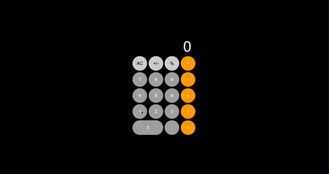

# calculator-project

Image:

Link:

Setup:

Purpose:

- To recreate a simple calculator using JS, HTML and SCSS/CSS.
- To practice DOM manipulation and reinforce JS concepts: objects, arrays, iterators, loops, if statements...
- To have fun and to see how much I have personally developed as a programmer by comparing the new branch to the alt branch.

MVP(Taken from The Odin Project):

- Create a function for basic math operators:

  - add - [x]
  - subtract - [x]
  - multiply - [x]
  - divide - [x]

- Create a function that takes an operator and 2 numbers and then calls one of the above functions on the numbers. - [x]

- Create a basic HTML calculator:

  - Buttons for each digit - [x]
  - Buttons for each operator - [x]
  - Equal button - [x]
  - Clear button - [x]

- Display should populate when you click number buttons. - [x]

- Calculator should not evaluate more than a single pair of numbers at a time. - [x]

Approach:

- To handle a continuous operation, I declared 2 arrays.
  - One handles the numbers inputted and become stored in 1 array.
  - Second handles operators clicked and stores into a second array.
- Created a third array that handles what is outputted on the calculator display.
- Created a module that houses the main operators (plus, minus, divide, multiply)
- Decided to build the entire calculator using HTML and some CSS. Then adding functionality to each button using JS.

Reflection:

- Initially wanted to imitate the iPhone calculator design and I think I copied it well.
- Although most of the logic of the calculator seems to be functional, there are a few things that can be improved:
  - Functions could be broken down even further to improve purity.

Future Goals:

- Refactor the code and logic to allow for continuous operation even after user clicks the equal button. In iPhone calculator, users are able to continue operation after pressing equal button however I was not able to get it done so in future, I would like to get this right.

Further reading:

Stay in touch:

Licence:

Contribution:

New logs:
11/01/2023

- Updated the HTML + CSS to imitate the iphone calculator aesthetic.
- Implemented BEM naming convention and SCSS.
- Refactored JS to make it more readable/understandable.
- Logic includes manipulating arrays instead of just the display inner text like in the old project.

<!-- Old logs:
04/08/2022

- Implemented basic math operation functions
  - addition, subtraction, multiplication, division
- Will implement operator function
  - function uses 3 parameters: 2 numbers and an operator function.

05/08/2022

- Implemented basic calculation function.
- Implemented basic layout of calculator.

06/08/2022

- Have implemented basic functioning of numbers appearing once you have clicked on it.
- Bugs to be fixed: 'undefined appearing on the calculator display if div container 'numbers' is clicked or event triggered.
- TBD: implement a feature where display content font size changes as more numbers are added. alternatively, we can try add a feature that allows the numbers to continue off but once it clips the display border, the number hides and only the most recent 10 or so numbers (maximum limit of digits allowed on display) to show.
- TBD: Be able to do a simple calculation.

06/08/2022

- Implemented simple calculation functionality.
- TBD:
  - Your calculator should not evaluate more than a single pair of numbers at a time. If we are doing a multi operator calculation, it should show result from first operation and then follow-up calculation from 2nd operation and so on and so forth.
  - Be able to do decimal calculation.
  - Put an error message when try to divide by 0.

07/08/2022

- Now able to do multiple operations one operation at at time.
- Able to do decimal calculations.
- Error message appears when user tries to divide by 0.
- TBD:
  - Implement CSS styling that removes the decimal button once one has been placed.
  - Only allows decimals up to 2 places for each result.
  - Allow a finite amount of numbers/characters on the 'display.textContent' at a time.

8/08/2022

- Implemented functional calculator that does multi-operant calculations one calculation at a time.
- Will need to implement a backspace/delete function that only backspaces 1 unit instead of clearing out the board.
- -->
